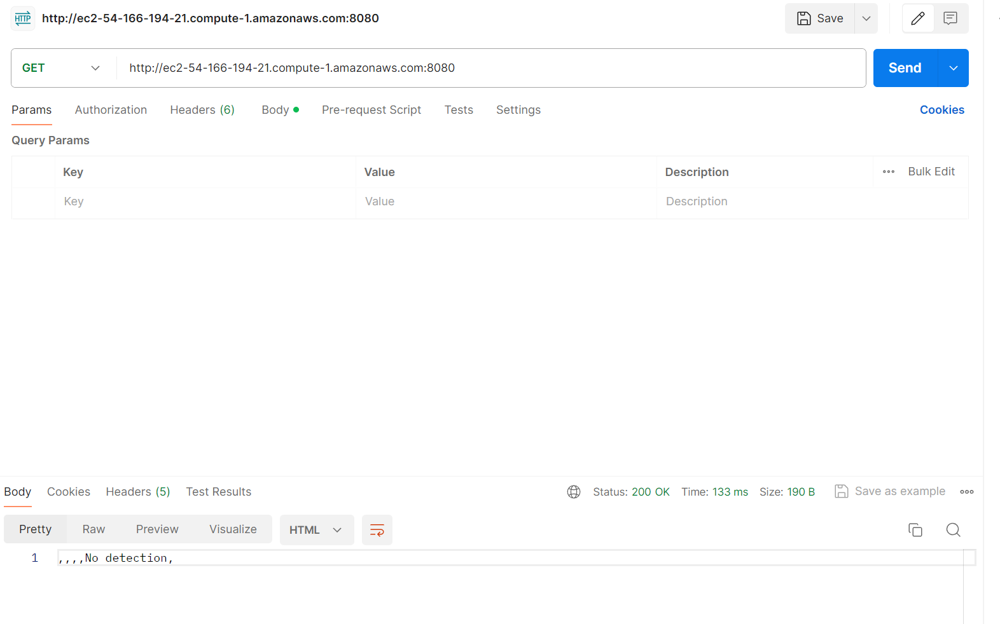
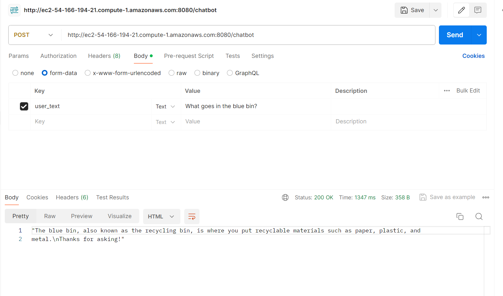

# WasteWise Application

This directory contains the WasteWise App backend python and flask scrips.

## Description

* The app.py flask script is hosted on AWS EC2 with endpoint http://ec2-54-166-194-21.compute-1.amazonaws.com:8080/
* To use the object detectoin model of the image waste sorting feature use endpoint http://ec2-54-166-194-21.compute-1.amazonaws.com:8080/wasteClassify , and http://ec2-54-166-194-21.compute-1.amazonaws.com:8080/chatbot for the chatbot.

## Getting Started

### ML models
* Object detection model on waste images
  * Post method
  * Receive form-data with the key 'image' and a string value of a Base64-encoded image.
  * Return a string of the bounding box coordinates, class, and score value in the format 'xmin_str, ymin_str, xmax_str, ymax_str, class_label, confidence_score'.

* Chatbot
  * Post method
  * Receive form-data with the key 'user_text' and a string value of the user's input/question.
  * Return a string for the replay of the user's input.

### Endpoints tested with Postman 

