# WasteWise Application

This directory contains the WasteWise App frontend built with Ionic React from Ionic Framework.

## Description

The Ionic project was built with the Capacitor package to create Android and IOS projects.

## Getting Started

### Dependencies

* Node.js and npm are required to run the project.
* Android Studio is required to run the andriod project.
* Xcode is required to run the ios project.

### Installing

* Clone this github folder to your desired directory for WasteWise App frontend.

### Executing program

* Open terminal and navigate to your directory and run the codes below.
* Install required packages for the project, ex: ionic and capacitor.
```
npm install
```
* To run the web project:
```
ionic serve
```
* To open android project in android studio (make sure a device is set for android studio):
```
ionic cap open android
```
* To run the android project:
```
ionic cap run android
```
* To open ios project in Xcode:
```
ionic cap open ios
```
* To run the ios project:
```
ionic cap run ios
```
## Application Screens (Android)
Splash Screen
<p float="left">
    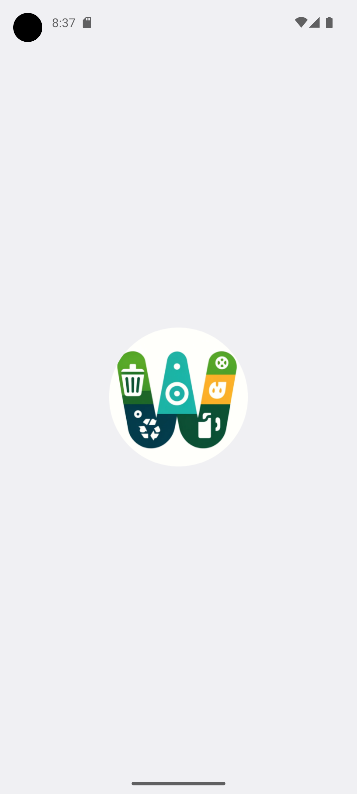
</p>

Intro Pages (component 'Intro' attached to home page)
<p float="left">
  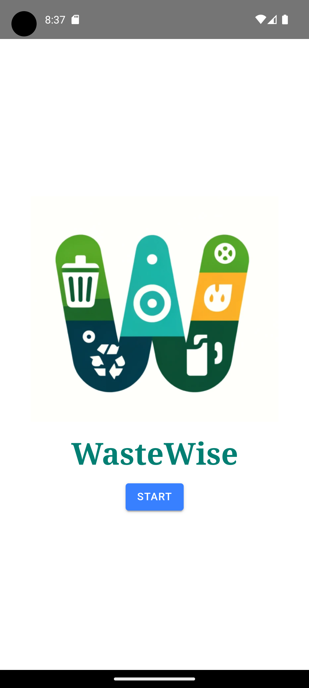
  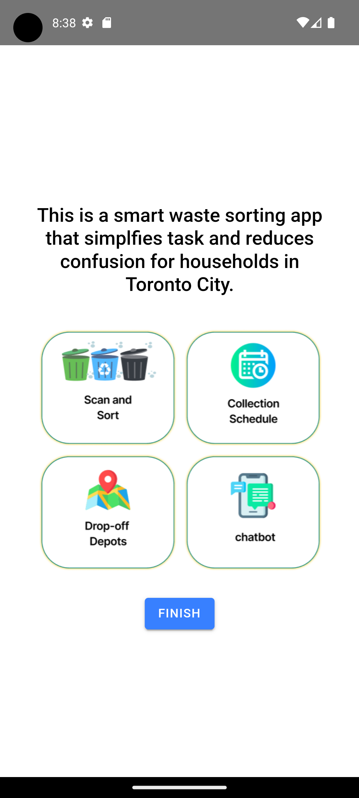
</p>

Home Page (Collection Schedule and Drop-off Depots features are disabled)
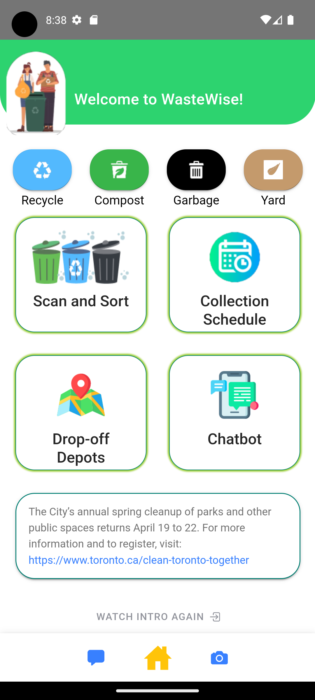

Recycle, Compost, Garbage, Yard pages (all sharing the same page format 'WasteSetOutTips.tsx')
<p float="left">
  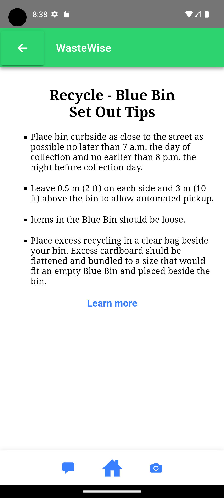
  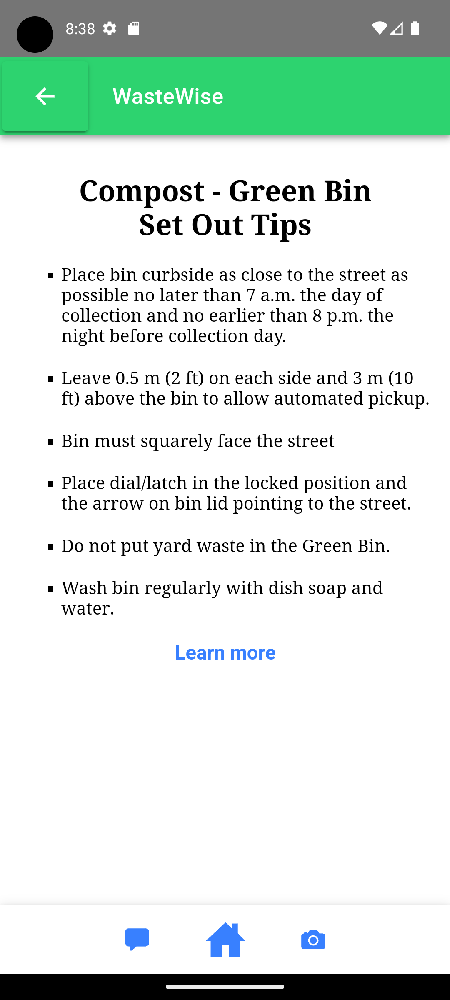
  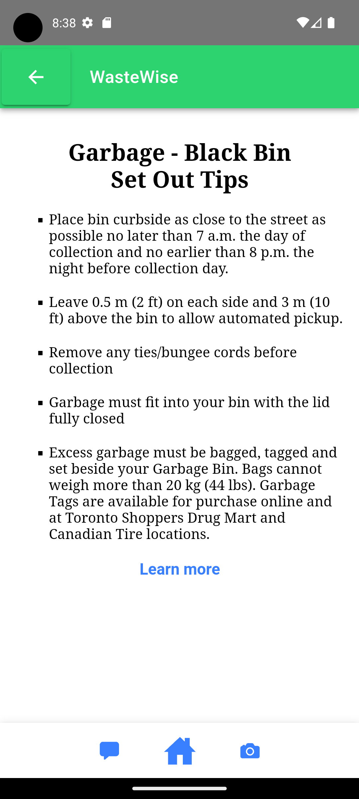
  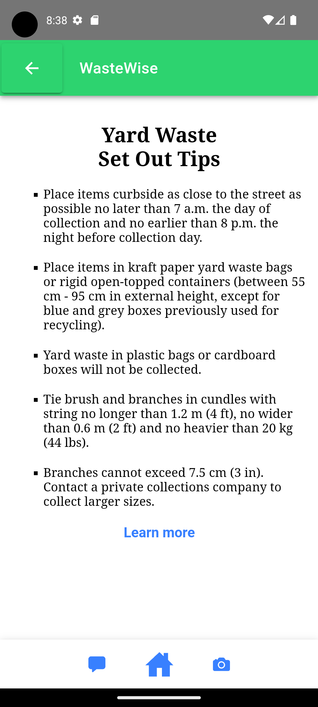
</p>

Scan and Sort Page
<p float="left">
  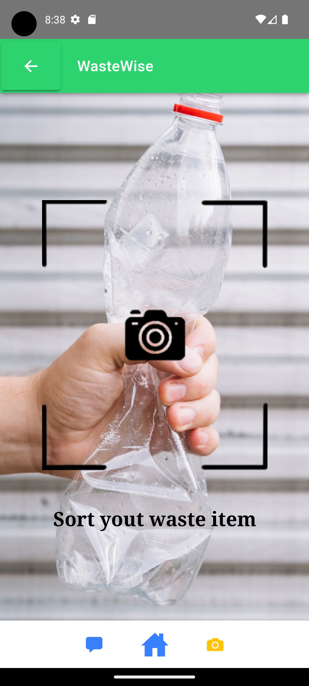
  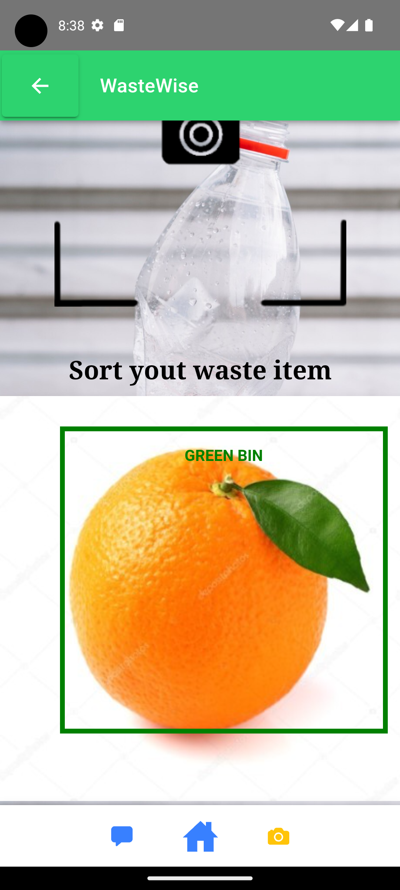
</p>

Chatbot page
<p float="left">
  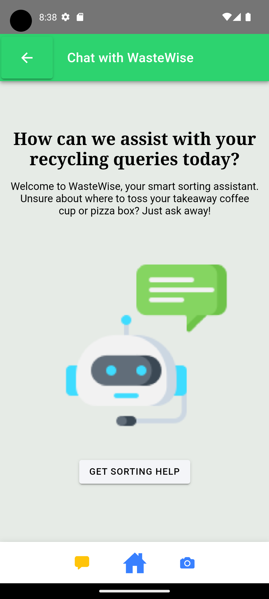
  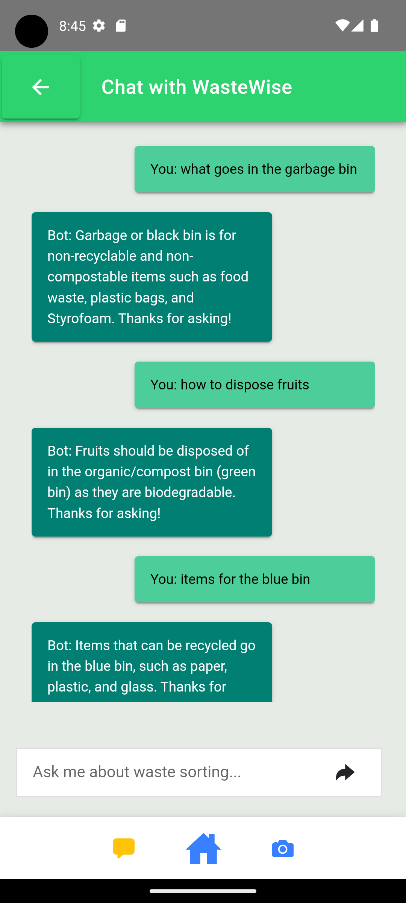
</p>

## Help

Questions regarding the ionic react app please refer to their [official site](https://ionicframework.com/docs/react).
